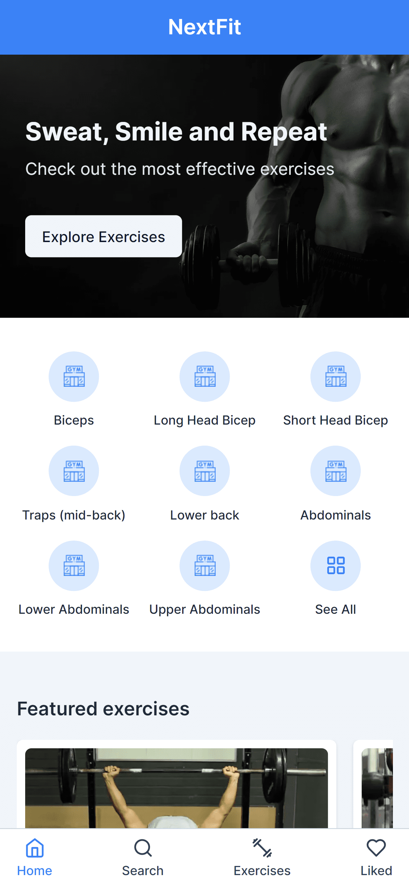

# NextFit 💪

Web Application that provides a collection of exercises and free exercise video demonstrations.

## Screenshots



## Live Website

<https://nextfitjs.vercel.app/>

## Local Setup

```bash
# install dependencies
npm install
# run the development server
npm run dev
```

Open [http://localhost:3000](http://localhost:3000) with your browser to see the result.

## Deploy on Vercel

The easiest way to deploy your Next.js app is to use the [Vercel Platform](https://vercel.com/new?utm_medium=default-template&filter=next.js&utm_source=create-next-app&utm_campaign=create-next-app-readme) from the creators of Next.js.

Check out our [Next.js deployment documentation](https://nextjs.org/docs/deployment) for more details.

## Credit

- Exercise data from [musclewiki.com](https://musclewiki.com)

## Website References

Here is some cool sites that inspired me

- [musclewiki.com](https://musclewiki.com/)
- [wargabantuwarga.com](https://www.wargabantuwarga.com/)
- [sayurbox.com](https://www.sayurbox.com/)
- [siapkerja.kemnaker.go.id](https://siapkerja.kemnaker.go.id/app/home)
